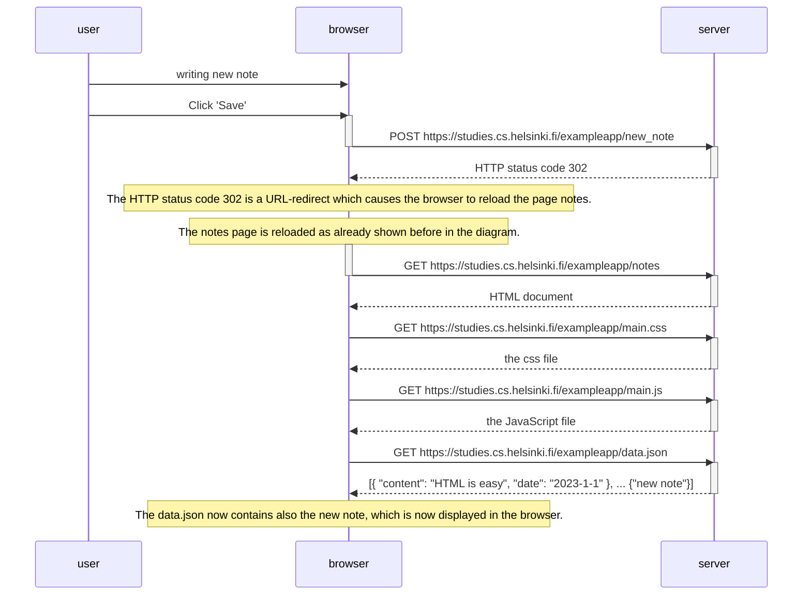

# 0.4 Diagram for saving new note
The diagram for adding a new note starts with the user typing the new note and clicking 'save'. This causes the browser to HTTP POST the new note to the server. The server parses the data and adds the note to its list of notes. 

The server then replies to the browser with a request to redirect. 
The browser page is reloaded in the exact same order of actions it was loaded in the first place. 

Now, since the data.json file on the server contains the new note, also that one is shown in the browser.

