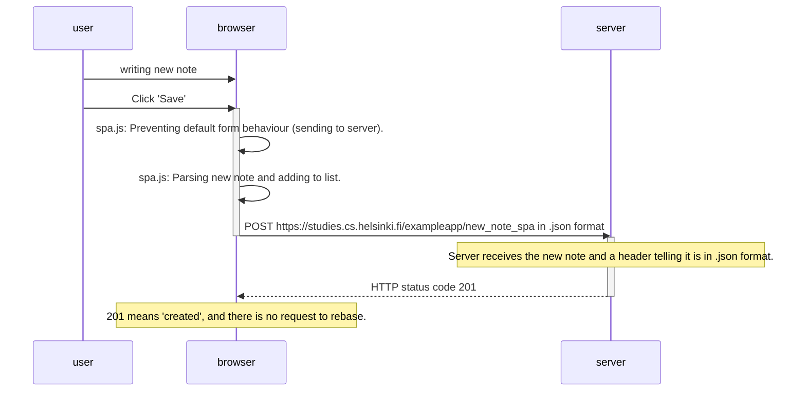

# 0.6 New note in SPA-diagram
The spa.js that was retrieved from the server contains JavaScript code for handling the new notes. When the user clicks 'Save', the code prevents the default form behaviour and instead creates a new element to the note-list, and sends the new note to the server, with a header telling it is in .json format. The server receives it and replies with HTTP status 201, which does not cause the browser to start reloading the page. 

